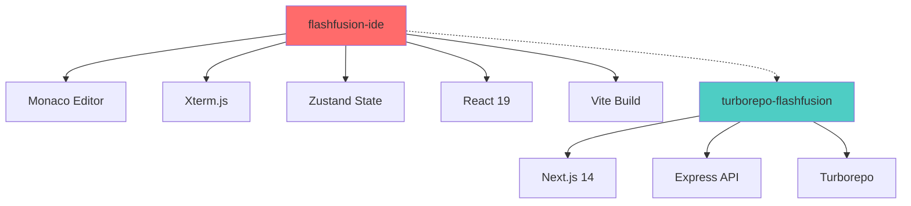
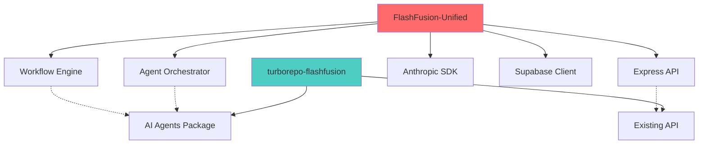

# Repository Dependency Matrix

This document maps the dependencies and relationships between Krosebrook repositories and identifies integration opportunities for the turborepo-flashfusion monorepo.

## Repository Classification

### 🎯 Core Platform Repositories

| Repository | Type | Technology | Status | Integration Priority | Dependencies |
|------------|------|------------|--------|---------------------|--------------|
| **turborepo-flashfusion** | Monorepo | Turborepo, Next.js | ✅ Current | N/A | Base repository |
| **flashfusion-ide** | IDE | React, TypeScript, Vite | ✅ Production-ready | 🔴 High | Monaco, Xterm, Zustand |
| **FlashFusion-Unified** | Backend | Express.js, Node.js | ✅ Feature-complete | 🔴 High | Anthropic, Supabase, Redis |

### 🛠️ Supporting Applications

| Repository | Type | Technology | Status | Integration Priority | Dependencies |
|------------|------|------------|--------|---------------------|--------------|
| **flashfusion-genesis** | App | TypeScript | ⚠️ 5 issues | 🟡 Medium | TBD |
| **flashfusion-loveable** | App | TypeScript | ⚠️ 5 issues | 🟡 Medium | TBD |
| **theaidashboard** | Dashboard | TypeScript | ⚠️ 1 issue | 🟡 Medium | AI Services |
| **knowledge-base-app** | Knowledge | TypeScript | ✅ Stable | 🟡 Medium | Database |
| **cortex-second-brain-4589** | AI Brain | TypeScript | ⚠️ 5 issues | 🟡 Medium | AI Models |

### 🔧 Development Tools

| Repository | Type | Technology | Status | Integration Priority | Dependencies |
|------------|------|------------|--------|---------------------|--------------|
| **enhanced-firecrawl-scraper** | Tool | HTML/JS | ✅ Stable | 🟢 Low | Web scraping libs |
| **d1-rest** | API | TypeScript | ⚠️ 1 issue | 🟢 Low | D1 Database |
| **DevChat** | Chat | TypeScript | ⚠️ 7 issues | 🟢 Low | Chat libraries |
| **CGDSTARTER** | Starter | TypeScript | ⚠️ 6 issues | 🟢 Low | Starter templates |

### 🏗️ Infrastructure & Templates

| Repository | Type | Technology | Status | Integration Priority | Dependencies |
|------------|------|------------|--------|---------------------|--------------|
| **nextjs-with-supabase** | Template | TypeScript | ⚠️ 1 issue | 🟡 Medium | Next.js, Supabase |
| **nextjs-commerce** | E-commerce | TypeScript | ⚠️ 3 issues | 🟢 Low | Next.js, Commerce |
| **blindspot-whisperer** | Tool | TypeScript | ✅ Stable | 🟢 Low | TypeScript |

### 🔐 Authentication & Services

| Repository | Type | Technology | Status | Integration Priority | Dependencies |
|------------|------|------------|--------|---------------------|--------------|
| **OAuth** | Auth | Generic | ✅ Stable | 🟡 Medium | OAuth libraries |
| **FFSignup** | Signup | Generic | ✅ Stable | 🟡 Medium | Auth systems |
| **tessa** | Assistant | Generic | ✅ Stable | 🟢 Low | AI Services |

### 🎮 Specialized Projects

| Repository | Type | Technology | Status | Integration Priority | Dependencies |
|------------|------|------------|--------|---------------------|--------------|
| **HabboHotel** | Game | Generic | ✅ Stable | ⭕ None | Gaming libraries |

## Dependency Analysis

### Primary Dependencies (High Impact)

#### 1. flashfusion-ide → turborepo-flashfusion


**Integration Benefits:**
- ✅ Modern IDE experience within monorepo
- ✅ Consistent development environment
- ✅ Shared component library potential

**Integration Challenges:**
- ⚠️ React version alignment (19 vs 18)
- ⚠️ Build system differences (Vite vs Next.js)
- ⚠️ State management compatibility

#### 2. FlashFusion-Unified → turborepo-flashfusion


**Integration Benefits:**
- ✅ Mature agent orchestration system
- ✅ Proven workflow engine
- ✅ Comprehensive AI integrations

**Integration Challenges:**
- ⚠️ Monolithic architecture needs refactoring
- ⚠️ Different dependency versions
- ⚠️ Database migration requirements

### Secondary Dependencies (Medium Impact)

#### Technology Stack Compatibility Matrix

| Repository | React | TypeScript | Node.js | Database | AI Service | Build Tool |
|------------|-------|------------|---------|----------|------------|------------|
| turborepo-flashfusion | 18 | 5.9.2 | 18+ | Supabase | Anthropic/OpenAI | Next.js/Turbo |
| flashfusion-ide | 19 | 5.8.3 | 18+ | None | None | Vite |
| FlashFusion-Unified | None | 5.4.3 | 18+ | Supabase/Redis | Anthropic/OpenAI | Node.js |
| theaidashboard | Yes | Latest | 18+ | TBD | AI Services | TBD |
| nextjs-with-supabase | 18 | Latest | 18+ | Supabase | None | Next.js |
| knowledge-base-app | Yes | Latest | 18+ | Database | None | TBD |

### Shared Dependencies

#### Common Technologies Across Repositories
```yaml
High Usage:
  - TypeScript: 15/19 repositories (79%)
  - Node.js 18+: 12/19 repositories (63%)
  - React: 8/19 repositories (42%)
  - AI Services: 6/19 repositories (32%)

Medium Usage:
  - Supabase: 4/19 repositories (21%)
  - Next.js: 3/19 repositories (16%)
  - Express.js: 3/19 repositories (16%)

Low Usage:
  - Vite: 2/19 repositories (11%)
  - Vue.js: 1/19 repositories (5%)
  - Turborepo: 1/19 repositories (5%)
```

## Integration Strategy

### Phase 1: High-Priority Integrations

#### 1. flashfusion-ide → apps/ide
```bash
# Integration complexity: Medium
# Expected timeline: 1-2 weeks
# Key challenges:
- React version upgrade (18 → 19)
- Build system integration (Vite → Turbo)
- State management alignment

# Benefits:
- Modern IDE capabilities
- Consistent development experience
- Enhanced productivity tools
```

#### 2. FlashFusion-Unified → Multiple packages
```bash
# Integration complexity: High
# Expected timeline: 2-3 weeks
# Key challenges:
- Monolithic refactoring
- Database migration
- API endpoint consolidation

# Target packages:
packages/agent-orchestrator/     # Agent coordination
packages/workflow-engine/        # Workflow execution
packages/auth/                   # Authentication
packages/database/               # Database services
```

### Phase 2: Medium-Priority Integrations

#### 3. Supporting Applications
```bash
# Integration complexity: Low-Medium
# Expected timeline: 1-2 weeks per app

# Candidates for apps/ directory:
theaidashboard → apps/dashboard/
knowledge-base-app → apps/knowledge-base/
nextjs-with-supabase → apps/supabase-demo/
```

#### 4. Development Tools
```bash
# Integration complexity: Low
# Expected timeline: 1 week

# Candidates for tools/ directory:
enhanced-firecrawl-scraper → tools/scraper/
OAuth → packages/auth/oauth/
FFSignup → packages/auth/signup/
```

### Phase 3: Specialized Integrations

#### 5. Templates and Starters
```bash
# Integration complexity: Low
# Expected timeline: 3-5 days per template

# Candidates for templates/ directory:
CGDSTARTER → templates/cgd-starter/
nextjs-commerce → templates/commerce/
```

## Risk Assessment

### High-Risk Integrations

| Repository | Risk Level | Primary Concerns | Mitigation Strategy |
|------------|------------|------------------|-------------------|
| FlashFusion-Unified | 🔴 High | Monolithic refactoring, breaking changes | Gradual extraction, parallel development |
| flashfusion-ide | 🟡 Medium | React version conflicts, build differences | Version alignment, build tool integration |

### Medium-Risk Integrations

| Repository | Risk Level | Primary Concerns | Mitigation Strategy |
|------------|------------|------------------|-------------------|
| theaidashboard | 🟡 Medium | Dependency conflicts, incomplete features | Dependency audit, feature completion |
| cortex-second-brain-4589 | 🟡 Medium | 5 open issues, stability concerns | Issue resolution, testing |

### Low-Risk Integrations

| Repository | Risk Level | Primary Concerns | Mitigation Strategy |
|------------|------------|------------------|-------------------|
| enhanced-firecrawl-scraper | 🟢 Low | Simple integration | Direct copy/adaptation |
| OAuth | 🟢 Low | Standard patterns | Package extraction |
| tessa | 🟢 Low | Minimal dependencies | Service integration |

## Success Metrics

### Integration Success Criteria

#### Technical Metrics
- ✅ All packages build successfully
- ✅ No TypeScript errors
- ✅ Test coverage >80%
- ✅ Build time <5 minutes
- ✅ Development server starts <30 seconds

#### Functional Metrics
- ✅ IDE functionality preserved
- ✅ Agent orchestration working
- ✅ Workflow execution operational
- ✅ API endpoints functional
- ✅ Authentication systems active

#### Developer Experience Metrics
- ✅ Hot reload working across apps
- ✅ Shared components usable
- ✅ CLI tools functional
- ✅ Documentation complete
- ✅ Onboarding time <1 hour

## Conclusion

The repository dependency analysis reveals a well-structured ecosystem with clear integration opportunities. The recommended approach prioritizes:

1. **High-impact, proven repositories** (flashfusion-ide, FlashFusion-Unified)
2. **Technology stack alignment** (TypeScript, React, Node.js)
3. **Gradual integration** to minimize risk
4. **Comprehensive testing** to ensure stability

This strategy ensures maximum benefit while maintaining system stability and developer productivity.